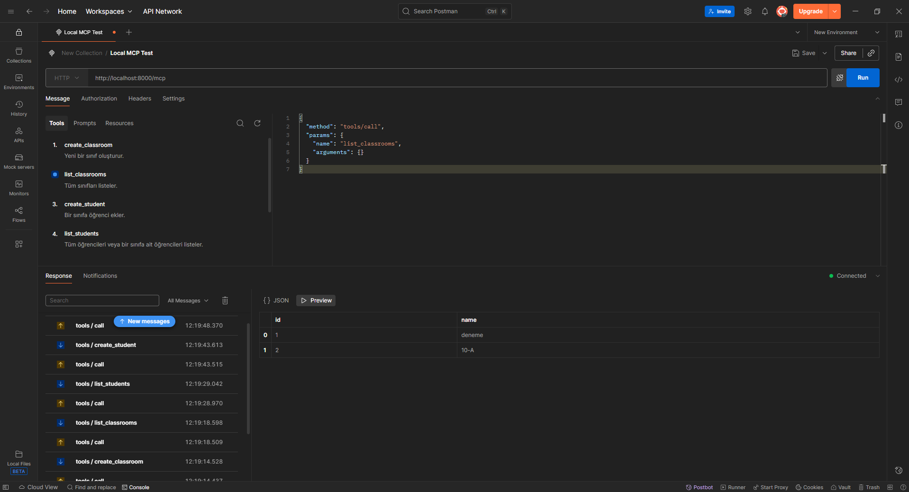
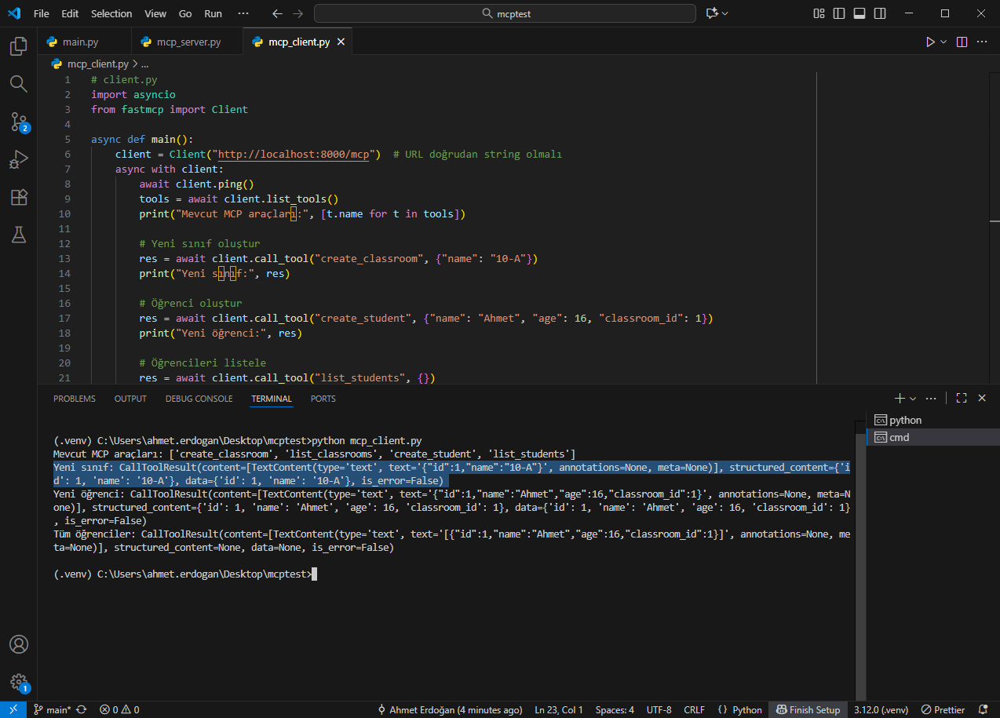

# School API - FastAPI + SQLite + FastMCP

Bu proje, **FastAPI** ve **SQLite** kullanarak oluşturulmuş bir okul yönetimi API’sidir.  
Ayrıca, **FastMCP** ile MCP (Model Context Protocol) uyumlu bir sunucuya dönüştürülmüştür.

Projede **Sınıf (Classroom)** ve **Öğrenci (Student)** modelleri vardır ve hem CRUD hem de sınıf-öğrenci ilişkisi yönetilebilir.

---

## 📦 Özellikler

- **FastAPI** tabanlı REST API
- **SQLite** veritabanı (otomatik oluşturulur)
- **SQLAlchemy ORM** kullanımı
- **CRUD** işlemleri: Sınıf ve Öğrenci
- **Sınıf ile öğrencileri birlikte yönetme** endpoint’leri
- **MCP Server** olarak çalışabilir
- Swagger UI ve ReDoc dokümantasyonu destekler

---

## ⚙️ Kurulum

1. Projeyi klonlayın veya indirin
2. Virtual environment oluşturun (opsiyonel ama önerilir):

```bash
python -m venv .venv
.venv\Scripts\activate  # Windows
# veya
source .venv/bin/activate  # Linux/Mac
```

3. Gerekli paketleri yükleyin:

```bash
pip install -r requirements.txt

```

🚀 Sunucuyu Çalıştırma

Server’ı başlatmak için:

```bash
python mcp_server.py

```

MCP endpoint’leri: http://localhost:8000/mcp/...

Swagger UI: http://localhost:8000/docs

ReDoc: http://localhost:8000/redoc

Server Görüntüsü




💻 MCP Client Kullanımı

```bash
import asyncio
from fastmcp import Client

async def main():
    client = Client("http://localhost:8000/mcp")
    async with client:
        await client.ping()
        tools = await client.list_tools()
        print("Mevcut MCP araçları:", [t.name for t in tools])

        # Örnek: Sınıf oluştur
        res = await client.call_tool("create_classroom", {"name": "10-A"})
        print("Yeni sınıf:", res)

        # Örnek: Öğrenci oluştur
        res = await client.call_tool("create_student", {"name": "Ahmet", "age": 16, "classroom_id": 1})
        print("Yeni öğrenci:", res)

asyncio.run(main())

```

Client Görüntüsü




📝 Veritabanı

SQLite kullanır ve proje klasöründe otomatik olarak school.db dosyası oluşturulur.

Modeller:

Classroom: id, name

Student: id, name, age, classroom_id


📄 Dokümantasyon

Swagger UI: http://localhost:8000/docs

ReDoc: http://localhost:8000/redoc

⚡ Gereksinimler

Python 3.10+

FastAPI

SQLAlchemy

FastMCP

Uvicorn

Tüm paketler requirements.txt içinde listelenmiştir.

📌 Notlar

MCP araçları @mcp.tool ile tanımlanır.

FastAPI endpoint’leri Swagger/ReDoc üzerinden test edilebilir.

MCP client asenkron (async) çalışır.